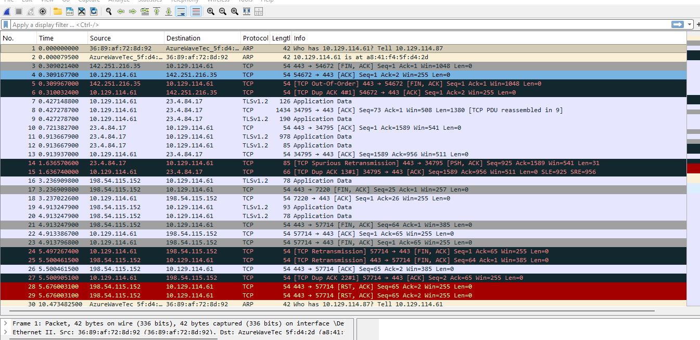
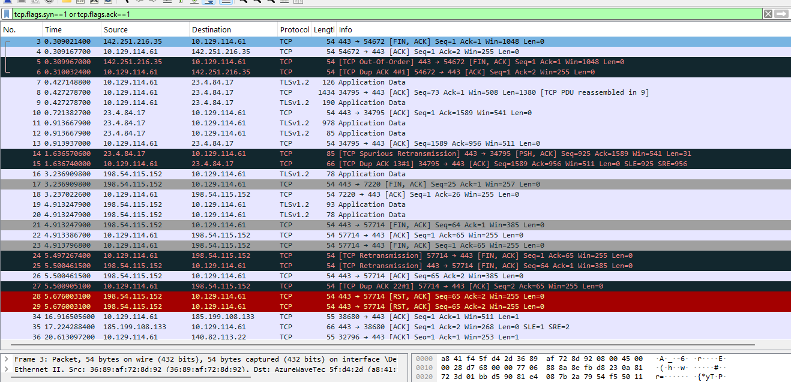

# wireshark-traffic-analysis
Network traffic analysis project using Wireshark to capture and analyze packets, including TCP handshakes and HTTP requests.
🌐 Network Traffic Analysis using Wireshark

📌 Overview

This project demonstrates how to capture and analyze network traffic using Wireshark, a powerful tool used in cybersecurity for packet analysis and network troubleshooting.

🎯 Objectives

- Capture live network packets
- Analyze TCP handshakes
- Identify HTTP requests and responses
- Understand how data travels across a network

🛠️ Tools Used

- Wireshark
- Windows / Kali Linux

🚀 Steps Performed

1. Packet Capture
   

Started capturing live network traffic using Wireshark on the active network interface.

2. Filtering Traffic

Applied filters to focus on specific traffic:

tcp

http

3. TCP Handshake Analysis

Observed the 3-way handshake process:

- SYN
- SYN-ACK
- ACK

4. HTTP Analysis

Captured HTTP requests and responses between client and server.

📊 Results

- Successfully captured and analyzed TCP packets
- Identified HTTP communication between devices
- Understood how protocols operate in real-time

⚠️ Ethical Consideration

All traffic captured was from a personal lab environment or authorized network.

🧠 What I Learned

- How packet sniffing works
- Importance of network protocols
- Basics of traffic analysis in cybersecurity

📎 Conclusion

This project strengthened my understanding of network communication and is a key step toward becoming a cybersecurity professional.

---

⭐ Feel free to connect with me on LinkedIn and explore more of my projects!
